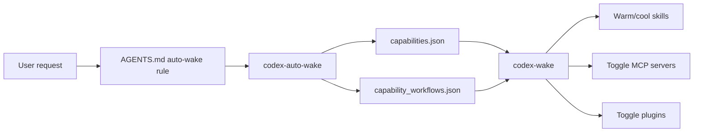

# Codex Capability Hub

[中文文档](README.zh-CN.md) | English

**Codex Capability Hub** is a lightweight framework for lazy-loading Codex capabilities: skills, MCP servers, plugins, and multi-step workflows.

It is designed for users who want both:

1. a fast Codex app startup path, especially on Windows; and
2. a rich toolbox of skills, MCPs, and plugins that can be woken only when needed.

## Why this project exists

Codex can become noticeably slower when too many optional capabilities are hot at startup. On Windows, the slowdown can be especially visible during app startup and UI loading because plugin discovery, skill scanning, and MCP initialization can all add overhead.

Capability Hub keeps the always-on layer small. Heavy skills, MCP servers, and plugins stay cold until a user request clearly needs them.

In one real Windows setup, after moving heavy capabilities to lazy loading:

| Operation | Before | After |
| --- | ---: | ---: |
| `plugin/list` | ~10–15 s | ~22 ms |
| `skills/list` | ~10 s | ~109 ms |

Your exact numbers will depend on hardware, installed capabilities, plugin cache state, antivirus scanning, and Codex version. The goal is not a fixed benchmark; the goal is a better architecture: **fast startup first, rich capabilities on demand**.

## How it works



Core ideas:

- Keep only a tiny router hot.
- Describe capabilities in JSON registries.
- Let `codex-auto-wake` map natural language to a capability or workflow.
- Let `codex-wake` warm skills, toggle MCP servers, toggle plugins, or progress a workflow.
- Sleep heavy one-off capabilities after use.

## What this repository contains

- `scripts/`: Python implementation.
- `powershell/`: Windows wrappers, installer, and uninstaller.
- `examples/`: safe example registries and an `AGENTS.md` snippet.
- `schemas/`: JSON schema for the capability registry.
- `docs/`: architecture, workflows, Windows performance, and security notes.
- `tests/`: routing and registry tests.

## What this repository does not contain

This repository is **not** a backup of a private `~/.codex` directory. Do not publish:

- API keys, tokens, or `~/.codex/config.toml`.
- Private skills or proprietary plugin cache content.
- Browser profiles, cookies, or login-state data.
- Project-specific private documents, papers, datasets, or credentials.

## Quick start

### 1. Clone

```powershell
git clone https://github.com/895122938/codex-capability-hub.git
cd codex-capability-hub
```

### 2. Install into your Codex home

```powershell
powershell -ExecutionPolicy Bypass -File .\powershell\install.ps1
```

By default, this installs scripts and example registries to:

```text
%USERPROFILE%\.codex\repair-tools
```

### 3. Test routing without changing state

```powershell
$env:USERPROFILE\.codex\repair-tools\codex-auto-wake.ps1 -Text "help me debug this failing test" -DryRun
$env:USERPROFILE\.codex\repair-tools\codex-auto-wake.ps1 -Text "make a PPT and export PDF" -DryRun
```

### 4. Add auto-wake instructions to Codex

Copy the snippet from:

```text
examples/AGENTS.capability-hub.example.md
```

into your project-level or global `AGENTS.md`.

The core instruction is:

```powershell
$env:USERPROFILE\.codex\repair-tools\codex-auto-wake.ps1 -Text "<user request>" -Apply
```

For end-to-end tasks, prefer progressive workflow routing:

```powershell
$env:USERPROFILE\.codex\repair-tools\codex-auto-wake.ps1 -Text "<user request>" -Apply -PreferWorkflow
```

## Configure your own capabilities

After installation, edit:

```text
%USERPROFILE%\.codex\repair-tools\capabilities.json
%USERPROFILE%\.codex\repair-tools\capability_workflows.json
%USERPROFILE%\.codex\repair-tools\capability_links.json
%USERPROFILE%\.codex\repair-tools\capability_interfaces.json
%USERPROFILE%\.codex\repair-tools\plugin_aliases.json
```

You can also point the tools at alternate registry files:

```powershell
$env:CODEX_CAPABILITIES_JSON = "C:\path\to\capabilities.json"
$env:CODEX_CAPABILITY_WORKFLOWS_JSON = "C:\path\to\capability_workflows.json"
$env:CODEX_CAPABILITY_LINKS_JSON = "C:\path\to\capability_links.json"
$env:CODEX_CAPABILITY_INTERFACES_JSON = "C:\path\to\capability_interfaces.json"
$env:CODEX_PLUGIN_ALIASES_JSON = "C:\path\to\plugin_aliases.json"
```

Useful path overrides:

```powershell
$env:CODEX_HOME = "$env:USERPROFILE\.codex"
$env:CODEX_COLD_ARCHIVE = "$env:USERPROFILE\CodexColdArchive"
```

## Minimal capability example

```json
{
  "id": "debug",
  "type": "bundle",
  "description": "Root-cause debugging, diagnosis, TDD, and CI failure handling.",
  "triggers": ["bug", "test failure", "debug", "CI failure"],
  "aliases": ["debug", "bug"],
  "tags": ["debug", "test", "ci"],
  "risk_level": "low",
  "startup_cost_if_hot": "medium",
  "wake": [
    {"type": "skill", "name": "systematic-debugging"},
    {"type": "skill", "name": "tdd"}
  ],
  "sleep": [
    {"type": "skill", "name": "systematic-debugging"},
    {"type": "skill", "name": "tdd"}
  ]
}
```

Supported action types:

- `skill`: warm/cool a skill directory.
- `mcp`: toggle an MCP server in Codex config.
- `plugin`: toggle a Codex plugin and the plugin feature flag.
- `script`: run a local command.
- `instruction`: print guidance only.

## Daily commands

```powershell
codex-wake.ps1 list
codex-wake.ps1 list-verbose
codex-wake.ps1 explain debug
codex-wake.ps1 validate office
codex-wake.ps1 dry-run office
codex-wake.ps1 wake debug
codex-wake.ps1 sleep debug
```

Natural-language routing:

```powershell
codex-auto-wake.ps1 -Text "make a PPT and export PDF" -DryRun
codex-auto-wake.ps1 -Text "make a PPT and export PDF" -Apply
codex-auto-wake.ps1 -Text "find papers then write a report" -Apply -PreferWorkflow
```

Windows startup reset:

```powershell
codex-plugin-toggle.ps1 --lean-startup
codex-lean-hotpath.ps1 apply
```

Inventory and diagnostics:

```powershell
codex-capability-inventory.ps1 --json
codex-capability-health.ps1
codex-capability-health.ps1 --json
codex-capability-benchmark.ps1
codex-capability-doctor.ps1
```

The diagnostics layer is intentionally read-only by default:

- `health` checks hot-path risk: hot skills, plugin feature state, optional plugins, MCP count, and registry availability.
- `benchmark` measures framework-level proxy timings such as config parse, registry load, hot skill scanning, and router matching.
- `doctor` converts health findings into safe, copy-pastable PowerShell recommendations.

## Progressive workflows

Workflows allow you to connect multiple capability phases without loading everything at once.

Example:

```powershell
codex-wake.ps1 workflow-list
codex-wake.ps1 workflow-start research-to-paper
codex-wake.ps1 workflow-next
codex-wake.ps1 workflow-state
codex-wake.ps1 workflow-clear
```

`workflow-start` wakes only phase 1. Use `workflow-next` when you actually need the next phase.

## Sensitive capabilities

Mark broad or privacy-sensitive capabilities as:

```json
"sensitive": true
```

Recommended sensitive categories:

- authenticated Chrome / existing browser profile / cookies;
- broad filesystem MCP access;
- full browser plugins;
- any capability that can access private local data.

Capability Hub should not auto-wake these unless the user request clearly expresses that intent.

## Troubleshooting

### PowerShell script execution is blocked

Use:

```powershell
powershell -ExecutionPolicy Bypass -File .\powershell\install.ps1
```

### A plugin-heavy setup becomes slow again

Reset to the lean startup profile:

```powershell
$env:USERPROFILE\.codex\repair-tools\codex-plugin-toggle.ps1 --lean-startup
$env:USERPROFILE\.codex\repair-tools\codex-lean-hotpath.ps1 apply
```

### Bundled plugin cache looks broken

Try:

```powershell
$env:USERPROFILE\.codex\repair-tools\codex-plugin-toggle.ps1 --repair-cache
```

### A capability does not wake

Check:

```powershell
codex-wake.ps1 explain <capability-id>
codex-wake.ps1 validate <capability-id>
codex-auto-wake.ps1 -Text "<your request>" -DryRun
```

## Development

```powershell
python -m compileall scripts
python -m pytest -q
```

Before publishing changes, run a basic secret scan:

```powershell
Select-String -Path ".\**\*" -Pattern "ghp_","sk-","OPENAI_API_KEY","GITHUB_TOKEN","Authorization" -ErrorAction SilentlyContinue
```

## License

MIT. See [LICENSE](LICENSE).
