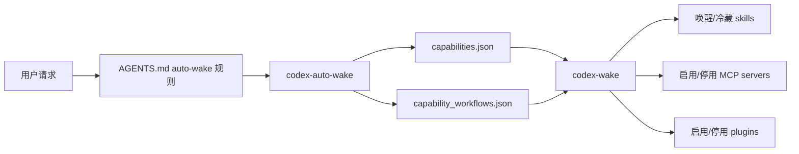

# Codex Capability Hub

中文 | [English](README.md)

**Codex Capability Hub** 是一个用于 **按需唤醒 Codex 能力** 的轻量级框架：支持 skills、MCP servers、plugins，以及多阶段 workflows。

它适合希望同时获得这两点的用户：

1. 更快的 Codex app 启动和界面加载速度，尤其是在 Windows 上；
2. 仍然保留丰富的 skills、MCP、plugins，只是在真正需要时再启用。

## 为什么需要它

如果 Codex 启动时一直加载大量可选能力，启动和界面加载会明显变慢。在 Windows 上，这个问题尤其容易被感知，因为 plugin discovery、skill 扫描、MCP 初始化都可能带来额外开销。

Capability Hub 的思路是：让常驻热路径保持很小。重型 skills、MCP servers、plugins 默认冷藏，只有用户请求明确需要时才唤醒。

在一个真实 Windows 配置中，把重能力改为按需唤醒后：

| 操作 | 优化前 | 优化后 |
| --- | ---: | ---: |
| `plugin/list` | 约 10–15 秒 | 约 22 ms |
| `skills/list` | 约 10 秒 | 约 109 ms |

不同机器和配置结果会不同。这个项目不承诺固定跑分，它追求的是更合理的架构：**先保证启动快，再按需获得强能力**。

## 工作原理



核心思路：

- 启动时只保留极小的路由层。
- 用 JSON registry 描述“能力”。
- `codex-auto-wake` 根据自然语言请求匹配 capability 或 workflow。
- `codex-wake` 负责实际唤醒 skill、启用 MCP、启用 plugin，或推进 workflow。
- 一次性重能力用完后可以 sleep，避免长期拖慢启动。

## 仓库包含什么

- `scripts/`：Python 核心实现。
- `powershell/`：Windows wrapper、安装脚本、卸载脚本。
- `examples/`：安全示例 registry 和 `AGENTS.md` 片段。
- `schemas/`：capability registry 的 JSON schema。
- `docs/`：架构、workflow、Windows 性能、安全说明。
- `tests/`：路由和 registry 测试。

## 仓库不包含什么

这个仓库 **不是** 私有 `~/.codex` 的备份。不要提交或发布：

- API key、token、`~/.codex/config.toml`。
- 私有 skills。
- 专有 plugin cache。
- 浏览器 profile、cookies、登录态。
- 任何项目私有文档、论文、数据集或凭据。

## 快速开始

### 1. 克隆仓库

```powershell
git clone https://github.com/895122938/codex-capability-hub.git
cd codex-capability-hub
```

### 2. 安装到 Codex 目录

```powershell
powershell -ExecutionPolicy Bypass -File .\powershell\install.ps1
```

默认会把脚本和示例 registry 安装到：

```text
%USERPROFILE%\.codex\repair-tools
```

### 3. 不改变状态地测试路由

```powershell
$env:USERPROFILE\.codex\repair-tools\codex-auto-wake.ps1 -Text "help me debug this failing test" -DryRun
$env:USERPROFILE\.codex\repair-tools\codex-auto-wake.ps1 -Text "make a PPT and export PDF" -DryRun
```

### 4. 添加自动唤醒规则

把下面文件中的片段复制到你的项目级或全局 `AGENTS.md`：

```text
examples/AGENTS.capability-hub.example.md
```

核心规则是：

```powershell
$env:USERPROFILE\.codex\repair-tools\codex-auto-wake.ps1 -Text "<user request>" -Apply
```

对于端到端任务，推荐使用渐进式 workflow 路由：

```powershell
$env:USERPROFILE\.codex\repair-tools\codex-auto-wake.ps1 -Text "<user request>" -Apply -PreferWorkflow
```

## 配置自己的能力

安装后，编辑：

```text
%USERPROFILE%\.codex\repair-tools\capabilities.json
%USERPROFILE%\.codex\repair-tools\capability_workflows.json
%USERPROFILE%\.codex\repair-tools\capability_links.json
%USERPROFILE%\.codex\repair-tools\capability_interfaces.json
%USERPROFILE%\.codex\repair-tools\plugin_aliases.json
```

也可以用环境变量指定其他 registry：

```powershell
$env:CODEX_CAPABILITIES_JSON = "C:\path\to\capabilities.json"
$env:CODEX_CAPABILITY_WORKFLOWS_JSON = "C:\path\to\capability_workflows.json"
$env:CODEX_CAPABILITY_LINKS_JSON = "C:\path\to\capability_links.json"
$env:CODEX_CAPABILITY_INTERFACES_JSON = "C:\path\to\capability_interfaces.json"
$env:CODEX_PLUGIN_ALIASES_JSON = "C:\path\to\plugin_aliases.json"
```

常用路径覆盖：

```powershell
$env:CODEX_HOME = "$env:USERPROFILE\.codex"
$env:CODEX_COLD_ARCHIVE = "$env:USERPROFILE\CodexColdArchive"
```

## 最小 capability 示例

```json
{
  "id": "debug",
  "type": "bundle",
  "description": "Root-cause debugging, diagnosis, TDD, and CI failure handling.",
  "triggers": ["bug", "test failure", "debug", "CI failure"],
  "aliases": ["debug", "bug"],
  "tags": ["debug", "test", "ci"],
  "risk_level": "low",
  "startup_cost_if_hot": "medium",
  "wake": [
    {"type": "skill", "name": "systematic-debugging"},
    {"type": "skill", "name": "tdd"}
  ],
  "sleep": [
    {"type": "skill", "name": "systematic-debugging"},
    {"type": "skill", "name": "tdd"}
  ]
}
```

支持的 action 类型：

- `skill`：唤醒/冷藏 skill 目录。
- `mcp`：启用/停用 Codex config 里的 MCP server。
- `plugin`：启用/停用 Codex plugin，并同步 plugin feature flag。
- `script`：运行本地命令。
- `instruction`：只打印提示说明。

## 常用命令

```powershell
codex-wake.ps1 list
codex-wake.ps1 list-verbose
codex-wake.ps1 explain debug
codex-wake.ps1 validate office
codex-wake.ps1 dry-run office
codex-wake.ps1 wake debug
codex-wake.ps1 sleep debug
```

自然语言路由：

```powershell
codex-auto-wake.ps1 -Text "make a PPT and export PDF" -DryRun
codex-auto-wake.ps1 -Text "make a PPT and export PDF" -Apply
codex-auto-wake.ps1 -Text "find papers then write a report" -Apply -PreferWorkflow
```

恢复 Windows 瘦身启动：

```powershell
codex-plugin-toggle.ps1 --lean-startup
codex-lean-hotpath.ps1 apply
```

生成能力清单与诊断：

```powershell
codex-capability-inventory.ps1 --json
codex-capability-health.ps1
codex-capability-health.ps1 --json
codex-capability-benchmark.ps1
codex-capability-doctor.ps1
```

诊断层默认只读，不会自动改配置：

- `health` 检查热路径风险：热 skills 数量、plugin feature 状态、显式启用的可选插件、MCP 数量、registry 是否可用。
- `benchmark` 度量框架层面的代理指标：配置解析、registry 加载、热 skill 扫描、路由匹配等耗时。
- `doctor` 把 health 发现转换成安全、可复制执行的 PowerShell 修复建议。

## 渐进式 workflows

Workflow 可以把多个能力阶段串起来，但不会一次性加载所有重依赖。

示例：

```powershell
codex-wake.ps1 workflow-list
codex-wake.ps1 workflow-start research-to-paper
codex-wake.ps1 workflow-next
codex-wake.ps1 workflow-state
codex-wake.ps1 workflow-clear
```

`workflow-start` 只唤醒第一阶段。真正需要下一阶段时，再使用 `workflow-next`。

## 敏感能力

对范围较广或涉及隐私的能力，建议标记：

```json
"sensitive": true
```

建议标记为 sensitive 的能力包括：

- 使用 Chrome 登录态、浏览器 profile、cookies；
- 广泛文件系统 MCP 访问；
- 完整浏览器插件；
- 任何可能访问本地私有数据的能力。

Capability Hub 不应该在用户意图不明确时自动唤醒这些能力。

## 排错

### PowerShell 阻止脚本执行

使用：

```powershell
powershell -ExecutionPolicy Bypass -File .\powershell\install.ps1
```

### 插件很多后又变慢

恢复瘦身启动：

```powershell
$env:USERPROFILE\.codex\repair-tools\codex-plugin-toggle.ps1 --lean-startup
$env:USERPROFILE\.codex\repair-tools\codex-lean-hotpath.ps1 apply
```

### bundled plugin cache 可能损坏

尝试：

```powershell
$env:USERPROFILE\.codex\repair-tools\codex-plugin-toggle.ps1 --repair-cache
```

### 某个能力没有被唤醒

检查：

```powershell
codex-wake.ps1 explain <capability-id>
codex-wake.ps1 validate <capability-id>
codex-auto-wake.ps1 -Text "<your request>" -DryRun
```

## 开发

```powershell
python -m compileall scripts
python -m pytest -q
```

发布前建议做一次基础 secret 扫描：

```powershell
Select-String -Path ".\**\*" -Pattern "ghp_","sk-","OPENAI_API_KEY","GITHUB_TOKEN","Authorization" -ErrorAction SilentlyContinue
```

## License

MIT。见 [LICENSE](LICENSE)。
