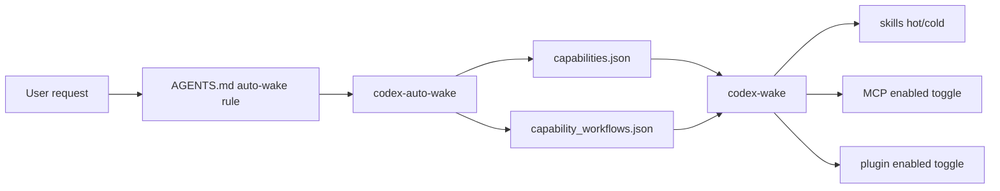

# Architecture

Capability Hub separates a tiny always-on router from heavy capability payloads.

Layers:

1. Instruction layer: `AGENTS.md` tells Codex when to route.
2. Registry layer: JSON files describe capabilities and workflows.
3. Execution layer: scripts make reversible local changes.
4. Payload layer: the user's actual skills, MCP servers, plugins, and tools.
